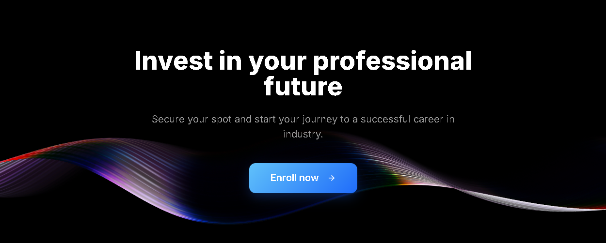
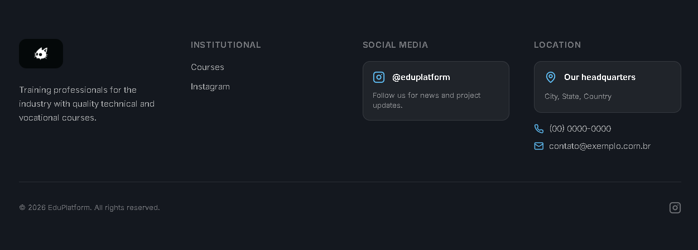

# EduPlatform - Modern Industrial Courses Landing Page

EduPlatform is a premium, open-source landing page template designed specifically for technical schools and industrial training centers. It features a futuristic dark-mode aesthetic, 3D interactive backgrounds, and multi-language support.


## 🚀 Overview

This project aims to provide a high-end, production-ready template for educational institutions. It leverages the latest web technologies to create an immersive user experience that stands out from traditional educational websites.

### Key Features

- **🌐 Multi-language Support**: Fully internationalized with Portuguese, English, and Polish. Includes automatic browser language detection and a custom language selector modal.
- **✨ Immersive Design**: Full-screen 3D interactive backgrounds powered by Spline.
- **📱 Fully Responsive**: Seamless experience across mobile, tablet, and desktop devices.
- **🎨 Glassmorphism UI**: Premium visual language using Tailwind CSS and Framer Motion.
- **⚡ High Performance**: Built with Vite for ultra-fast development and build times.
- **🧩 Modular Architecture**: Clean, component-based structure for easy customization.

## 🛠️ Tech Stack

- **Frontend Framework**: [React](https://reactjs.org/) with [TypeScript](https://www.typescriptlang.org/)
- **Build Tool**: [Vite](https://vitejs.dev/)
- **Styling**: [Tailwind CSS](https://tailwindcss.com/)
- **UI Components**: [shadcn/ui](https://ui.shadcn.com/)
- **Animations**: [Framer Motion](https://www.framer.com/motion/)
- **3D Graphics**: [Spline](https://spline.design/)
- **Internationalization**: [i18next](https://www.i18next.com/)
- **Icons**: [Lucide React](https://lucide.dev/)

---

## 📸 Screenshots

| Home Section | FAQ & Info |
| :---: | :---: |
|  |  |

| Future Section | Contact / Footer |
| :---: | :---: |
|  |  |

---

## 📦 Getting Started

### Prerequisites

- **Node.js**: Version 18.0 or higher
- **Package Manager**: npm, yarn, or bun

### Installation

1. **Clone the repository**:
   ```sh
   git clone https://github.com/your-username/edu-platform-template.git
   cd edu-platform/frontend
   ```

2. **Install dependencies**:
   ```sh
   npm install
   ```

### Running Locally

To start the development server with hot-reload:

```sh
npm run dev
```

The application will be available at `http://localhost:5173`.

### Building for Production

To create an optimized production build:

```sh
npm run build
```

The output will be generated in the `dist/` folder.

---

## 📂 Project Structure

```text
src/
├── components/     # UI Components (Navbar, Hero, Footer, etc.)
│   ├── ui/         # Base shadcn/ui components
│   └── ...
├── locales/        # Translation files (JSON)
├── pages/          # Page views (Index, NotFound)
├── App.tsx         # Main App component & Routing
├── i18n.ts         # Internationalization config
└── main.tsx        # Entry point
```

## ⚙️ Customization

- **Branding**: Overwrite `public/logo.jpg` to update the global site logo. The header and footer will reflect this change.
- **Default Language**: Change the `lng` property in `src/i18n.ts` to set your preferred default language.
- **Colors**: Customize the primary color and dark theme tokens in `src/index.css`.
- **Translations**: Add or modify strings in `src/locales/` to support more languages.

---

## 📄 License

This project is licensed under the MIT License - see the LICENSE file for details.
